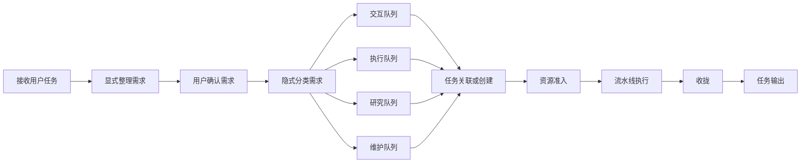
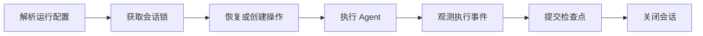
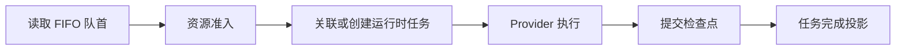
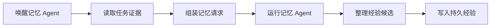
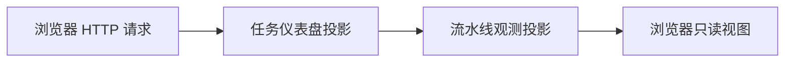

# HumanAgent DAGpipe SESE Audit

Status: `CANDIDATE / PENDING REVIEW`
Date: 2026-09-26
Baseline: `0189d5893baa5cc42d06e98ce7bc09dbc99e3b7a`

## Scope

This audit covers the current project architecture at the baseline commit. It
does not replace the development lifecycle, review process, or merge order.
The goal is to model the real business-object flows as independent DAGpipe
graphs, each with exactly one declared input and one declared output (SESE),
and to record which nodes are wired into a live product entrypoint.

Evidence layers remain separate:

- runtime and UI source under `packages/`;
- focused tests under `tests/`;
- product entrypoints in `packages/app/src/cli.ts`;
- design contracts in `docs/architecture/`;
- static DAGpipe validation from `dagpipe graph validate` and
  `dagpipe graph inspect`.

The DAGpipe CLI validates static topology, one declared input and output per
graph, acyclic edges, ARC references, and syntactic `operator@version`
bindings. It does not load project code or prove that an Operator is
implemented. Runtime execution would require a project-owned Rust registry and
`compile()` gate, which this audit does not claim.

## Graph inventory

Each file below is an independent SESE graph. A business object enters exactly
one declared input and leaves exactly one declared output.

| Graph | Input | Output | Business scope |
|---|---|---|---|
| `docs/dagpipe/explicit-requirement.graph.json` | `user_task_input` | `completed_task` | User task through explicit confirmation, implicit classification, queue, admission, execution, settlement, and output |
| `docs/dagpipe/headless-session.graph.json` | `session_plan` | `terminal_session` | Headless `run`/`resume` from session plan to recoverable terminal session |
| `docs/dagpipe/serve-task.graph.json` | `confirmed_requirement` | `completed_task_projection` | Live `serve` from a confirmed requirement to a completed task projection |
| `docs/dagpipe/memory-curation.graph.json` | `settled_checkpoint` | `durable_memory_lesson` | Settled checkpoint through memory analysis to durable lesson |
| `docs/dagpipe/observation-read.graph.json` | `browser_request` | `rendered_view` | Read-only browser observation from HTTP request to rendered view |

The graphs are not a function-call map. Node labels are business steps; the
mapping table below is supporting traceability, not the semantic graph itself.

## Semantic DAG: explicit requirement mainline



Current state:

| Semantic node | Owner | Implementation binding | State |
|---|---|---|---|
| 接收用户任务 | `packages/app/src/ui-runtime/service.ts` | explicit input HTTP API and service methods | `LIVE` |
| 显式整理需求 | `packages/runtime/src/intake/explicit-intake.ts` | normalization, matching, proposal | `LIVE` |
| 用户确认需求 | `packages/runtime/src/intake/explicit-intake.ts`, `packages/app/src/ui-runtime/service.ts` | confirmation ledger and `RequirementEnvelope` submission | `LIVE` |
| 隐式分类需求 | `packages/runtime/src/admission/implicit-admission.ts` | `classifyConfirmedRequirement` | `LIVE` |
| 四类队列 | `packages/runtime/src/intake/requirement-inbox.ts` | FIFO inbox and admission queue kind | `LIVE` |
| 任务关联或创建 | `packages/runtime/src/ui-runtime/coordinator.ts` | `appendTaskInput` / task creation | `LIVE` |
| 资源准入 | `packages/runtime/src/admission/implicit-admission.ts`, `packages/app/src/ui-runtime/service.ts` | `admitRequirement` and coordinator dispatch | `LIVE` |
| 流水线执行 | `packages/runtime/src/ui-runtime/coordinator.ts` | provider-neutral execution | `LIVE` |
| 收拢 | `packages/runtime/src/checkpoints`, `packages/runtime/src/control` | checkpoint commit and settlement | `LIVE` |
| 任务输出 | `packages/ui/projection/runtime.ts` | task dashboard and list projection | `LIVE` |

The graph is acyclic and SESE. Retry is represented by a new execution attempt
identity outside this static graph, not by an edge back to an earlier node.

## Semantic DAG: headless session



Current state: `LIVE` for `run` and `resume` in
`packages/app/src/cli.ts`. DSH is the live headless backend; fake mode remains
available for deterministic tests.

## Semantic DAG: serve task



Current state: `LIVE` for fake and RCC provider paths. The T5 candidate
`8316c04` adds the FIFO-owned serve consumer and queued visibility; it is
currently `DELIVERED / PENDING REVIEW`, not merged.

## Semantic DAG: memory curation



Current state: `PARTIAL`. The boundary publisher and deterministic consumer are
live, but the configured model driver path has an open P1 (`80ad80c`), and
task-bound evidence has an open P1 (`eab6700`). The graph is the target
business flow; the missing edges are implementation gaps, not fabricated
success.

## Semantic DAG: observation read



Current state: `LIVE` for read-only task and observation projections. The
observation surface does not consume requirements, mutate the queue, retry
operations, or execute steer; those are separate control paths.

## SESE and DAG findings

1. The explicit requirement mainline is the only graph that combines user
   input, confirmation, queueing, execution, and output. It is a single-source
   single-sink graph: `user_task_input` to `completed_task`.

2. The four admission queues are parallel branches with one join at
   `task_correlate_or_create`. This preserves a single entry and single exit
   while allowing the declared queue kinds to remain explicit.

3. Retry, recovery, and steer are not edges in the static graph. They must use a
   new execution or attempt identity. Adding a back edge would violate the
   DAGpipe contract and the project's control/business separation.

4. Memory curation is intentionally a side graph. It consumes a settled
   checkpoint and does not feed back into the mainline. The current model-driver
   and task-evidence gaps are open P1s.

5. Observation is a read-only sink graph. It must not be wired as a control
   path that consumes requirements or executes operations.

## Change boundary

Allowed in this audit candidate:

- `docs/dagpipe/**`
- `docs/architecture/dagpipe-sese-audit-20260926.md`
- `scripts/dagpipe-validate-graphs.mjs`
- `package.json` script `dagpipe:validate`

Forbidden in this audit candidate:

- runtime source under `packages/**`
- tests under `tests/**`
- `.appsdk/**`, `note.md`, `main`, other worktrees
- modifying DAGpipe itself

Runtime adoption is a separate change. If the project later chooses to execute
these graphs through the DAGpipe Rust SDK, it needs a project-owned registry,
Operator implementations, effect declarations, and a `compile()` gate. The
current CLI validation is static governance evidence only.

## Verification

The candidate is valid when every graph below reports `valid DAG` with one
declared input and output:

```sh
dagpipe graph validate docs/dagpipe/explicit-requirement.graph.json
dagpipe graph validate docs/dagpipe/headless-session.graph.json
dagpipe graph validate docs/dagpipe/serve-task.graph.json
dagpipe graph validate docs/dagpipe/memory-curation.graph.json
dagpipe graph validate docs/dagpipe/observation-read.graph.json
```

Repeatable gate:

```sh
pnpm dagpipe:validate
```

`dagpipe graph inspect` provides operator bindings and deterministic waves. It
does not resolve the project's Rust registry or prove runtime execution.
