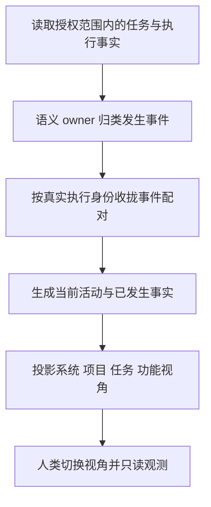
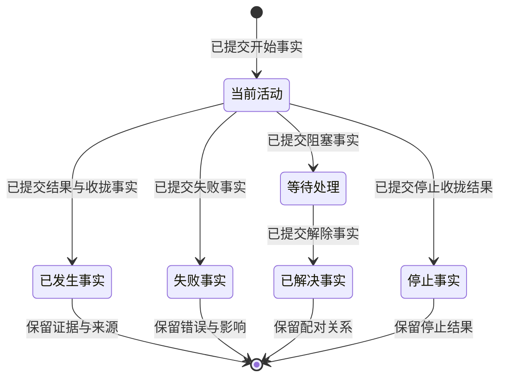

# 语义观测：功能差距与完整开发目标

交付范围：功能差距报告 + 可完整走查的静态 HTML 交互设计。本轮不修改生产功能。
状态：源码审计完成；后续生产开发目标保持 OPEN。原型使用 Mock 数据，不代表运行实例已具备这些能力。
审计输入：`origin/main 9d1f39c53f09e31a4636fa75f97042c18e8bb114`，版本 `0.1.0029`。
编排者：本次用户目标的执行者。实现由独立执行者负责；不自动建立 Collab 身份。

审计结论：当前已经具备运行引擎、动态 assignment 图、执行 fencing、触发调度、任务列表和实时事件入口。完整语义观测仍未闭环。最先要修的是 context-events→公开语义投影→UX 的断边；随后复用真实 assignment/项目身份补多视角，并新增任务阶段模板、计划修订历史和推理提交边界。新增 UI 约束一并计入。下文共列 12 个完整目标、18 项差距及对应验收。

## 1. 权威需求

来源：2026-10-07 本聊天用户原文。以下需求持续有效，不以实现方便或已有测试改变。

第一条消息：

> 1. 理论上，我们有不同的类型的任务（巡检，长程，单次），大致流程就不同，所以模板会不同
> 2. 对于固定的任务，每次隐式大脑进行编排会动态改变，本身就是动态的
> 3. 对于正在进行的推理，分拆为两部分：stable part + live part

本轮消息：

> 1. 你需要根据我们现有的项目实际开发的情况进行审计和修复，整理一个完整的开发目标和差距显式
> 2. 我们 UI 部分要使用最新提交的 context mode 的语义归类来渲染，ux 只关心语义，不关心真实 raw 流水，这个部分需要非常清晰的去耦合
> 3. 我们需要 ux 可以轻易的让人类从不同角度观测系统：从任务角度来切换和观测 live 任务，复盘完成的任务，也可以从功能角度来观测某一个 agent 在某一个任务中的执行或者当前的执行状态，也可以根据后台情况看当前总的概要，从上往下去看某个项目的细节

`context mode` 的当前项目实现对应 `packages/context-events` 与 `docs/architecture/context-events.md`。其 taxonomy、normalize、pairing、UI narrative 是语义归类的唯一 owner；UX 不新建另一套解释器。

用户随后明确本轮交付：

> 分两部分：1. 一个是功能差距 2. 一个是 ux 交互设计，你需要给一个静态 html 的交互设计，我可以从上面用 mock 的控件做完整的 tour，看到所有必要的界面展示

因此，下面的开发动作是后续实现合同。本轮交付审计结论和 `semantic-observation-tour.html`，不以原型中的模拟行为代替真实功能接线。

补充需求（2026-10-07，本聊天）：

> 我们界面也要控件化，可复用，不要每个页面重新写 ui

该要求同时约束静态原型与后续产品实现：页面是语义控件的组合，控件接收投影，不在各页面复制数据解释、状态和交互逻辑。

第二次补充（同日，本聊天）：

> 1. 整个 ui 系统都是 event driven
> 2. ui 系统都是模块化
> 3. payload 共享都是 arc

事件驱动与模块化是完整 UI 的要求，不能只给按钮增加 click 监听就宣称完成。arc 暂按不可变共享引用的合同设计，并明确模块数据边；浏览器用只读 JS 共享引用表达这一合同，不宣称 Rust 原生原子引用计数或跨进程零拷贝。用户已收到 arc 的异步语义澄清问题；该项仍是设计假设，生产具体类型必须在实施前按真实 owner 的契约确定。

## 2. 完整开发目标与验收

| ID | 用户结果 | 完成条件 | 唯一 owner | 验收入口 |
|---|---|---|---|---|
| G1 | 不同任务类型采用不同模板 | 巡检/长程/单次有真实 typed 模板绑定、不同必要阶段与终点；触发策略独立 | core 的领域规则；runtime 装配 | 创建三种任务，检查已提交模板绑定及实际流程 |
| G2 | 同一任务的编排会动态变化 | 任务实例能读当前计划、历史修订、节点/边差异和变更原因；已执行事实不被改写 | runtime 的编排 owner；core 生命周期 | 同一任务接收新事实后调整，验证历史与新计划、在途操作收拢 |
| G3 | 正在执行内容分为 stable/live | 已提交内容与当前活动分开；工具返回/失败能推进稳定事实；输出生成中不冒充完成 | context-events 语义 owner；UI projection | 同一轮工具 invoke/result 与后续活动、并行调用、失败、停止、刷新 |
| G4 | UX 消费共同语义 | 当前主界面使用 canonical → pairing → narrative；前端不读取 raw kind/arguments 推断状态/阶段；unmapped 显式可见 | context-events；packages/ui projection | 真实公开 API 到浏览器，成功/失败/未知类型与跨 scope 隔离 |
| G5 | 从任务角度切换 live 与复盘 | 可选任务；当前任务实时更新；终态任务可复盘；选择在刷新/链接中保留 | packages/ui；app 只读 API | 两任务并行、切换、终态、重新打开链接、空列表与读取失败 |
| G6 | 从功能角度看某 agent 的执行 | 能按真实 agent 身份和 task scope 查询当前/历史活动；功能角色和运行实例不混同 | runtime 真实身份生产者；UI projection | 同功能不同实例/不同任务，验证归属与状态隔离 |
| G7 | 从后台概要下钻项目细节 | 系统概要 → 已声明项目 → 任务 → 功能执行/节点；各层使用同一语义事实和真实 scope | app 只读组装；config 项目身份；UI projection | 总数与状态一致、项目隔离、面包屑返回、未知项目显式错误 |
| G8 | 观测与控制完全分离 | 观测请求不消费需求、不推进任务、不触发 retry/steer；raw 仅在主动证据查看时读取 | app API；runtime command owner | GET 前后任务/Journal 未变化，错误仍可读，控制入口维持原 owner |
| G9 | 界面控件化并复用 | 相同语义与交互由同一控件渲染；各视角只组合控件和传入作用域/数据；模板通过控件插槽表达差异 | packages/ui；现有 docs/ui 共享控件 owner | 同一任务/事实在不同视角的状态、证据、键盘和 drawer 行为一致；修改共享控件一次能作用于全部消费者 |
| G10 | 整个 UI 事件驱动 | 初次投影、语义更新、导航、连接状态、证据展开均走声明事件；模块按订阅更新；控件不跨模块直接修改状态或主动轮询解释 raw | UI 事件与订阅 owner；app 只提供 typed 数据事件 | 同一更新驱动受影响消费者；scope 隔离；卸载退订；失败/断连事件可见；Mock 推进只发模拟控制事件 |
| G11 | 整个 UI 模块化 | 输入适配、语义引用存储、事件通道、导航、视角组合、控件、证据与 Mock 驱动各有唯一接口/owner；生产数据驱动可替换 Mock 驱动 | packages/ui 组装与各控件 owner | 页面模块不重建投影/状态规则；Mock 与生产契约分开；同一控件在不同视角复用 |
| G12 | payload 以 arc 共享 | 语义 owner 产生不可变 payload；模块通过声明数据边共享同一引用；事件携引用及必要关联，不按页面复制 payload；更新产生新引用并保留旧版本 | 语义 payload 与 UI 共享引用 owner | 多消费者读到同一对象/版本；一个消费者不能修改其他消费者的内容；raw 证据独立；浏览器原型只验证共享引用语义，原生 Arc 由对应语言边界另验 |

G1–G12 均为总目标。可用增量不降低这些终验条件。未实现项保留 OPEN。G12 的具体类型仍需消除前述语义歧义。

## 3. 已核实的实际情况

| 能力 | 当前实现与证据 | 差距 / 判定 |
|---|---|---|
| 统一语义分类 | `packages/context-events/src/index.ts`；18 类 canonical，normalize、pairing、narrative 已实现 | 模块存在；尚不能据此宣称 UI 接入 |
| 模块测试 | `pnpm test:context-events`，基线 143/143，exit 0 | 只证明模块公开 consumer；不证明生产/UI 接线 |
| UI narrative 接线 | `toUserNarrative` 当前只在 context-events 内声明；packages 其他模块无消费者 | OPEN：共同语义层到 UI 的断边 |
| 观测 API | `UiRuntimeService.observation`，`packages/app/src/ui-runtime/service.ts:2199` | 根 scope 固定 registry；provider 子 scope 直接使用事件 kind 建节点 |
| 任务类型 | `Task`，`packages/contracts/src/index.ts:48`；agent-templates 只定义功能角色模板 | 无巡检/长程/单次阶段模板身份；禁止把角色模板当任务模板，也不能根据标题/耗时推断类型 |
| 触发与 occurrence | `ExecutionMode=once/scheduled/recurring`；`packages/runtime/src/subscriptions/index.ts:657`；app scheduler 与真实 occurrence 执行已接线 | 可复用触发、认领与任务绑定；触发频率不等于任务流程模板。调度图仍标 partial，不能报告整条巡检能力已完成 |
| 动态执行编排 | `packages/runtime/src/orchestration/assignment-graph.ts:201`；manager 的 planStage→dispatch→acceptResult→reviewAndMerge；app taskAssembly 已使用图快照 | 执行引擎已有，不需重建。动态图未进入 UI；任务计划版本、修订历史缺失；持久化/崩溃恢复没有本轮证据 |
| 隐式默认编排 | `packages/runtime/src/admission/implicit-orchestrator.ts:197` 当前默认发一个通用 executor subtask，按串行方式执行 | 引擎有动态图不等于 Brain 已根据三模板持续修订计划；还需真实规划输出、修订准入与版本接线 |
| 执行实例归属 | RuntimePoolLease 有 runtimeId/generation/epoch/ownerId/assignmentId；结果接受有 fencing；`assignment-graph.ts:397` | 底层已有真实绑定可复用；UI 却使用角色 frame。应公开已有真实归属，不能再造实例身份 |
| 当前轮次 | registry 明确 attempt 是轮次；`node-registry.ts:7`；观测迭代却取 executionEpoch，`service.ts:476` | attempt 与执行 epoch 混同，属于已确认的契约差距；后续按 assignment 真源修正 |
| 任务 scope | `ScopeRef`，`packages/contracts/src/index.ts:18` | organ/task/cycle/operation；无 project/agent 身份，不能自行拼接假身份 |
| 任务列表与概要 | `UiRuntimeService.listTasks/dashboard`，`service.ts:1961`；`tasks.js:142` 按生命周期分组，task-dashboard 有 SSE/轮询 | 已有任务切换与部分实时观测；复盘仍走 raw trace，没有语义复盘与项目维度 |
| 项目身份 | config 的 canonical workspace、`project.json`、RuntimePaths；`packages/config/src/index.ts:771`；runtime memory/workspace 装配已使用 projectKey | 身份已存在；未进入任务/观测公开投影与导航。跨项目总览也未接线，不能从路径或标题推断项目 |
| 现有 agent 展示 | `agentIdForRole/agentFrames`，`service.ts:606` | 角色到显示 frame 的映射；不能当作真实执行 agent 的 durable binding |
| 现有共享 UI | `docs/ui/runtime-shell.js` 的壳、状态、错误与导航函数；`interaction-work-card.js:1138` 的 mount/update 共享卡；Observation、交互页和卡片页有消费者 | 已有复用基础，应扩展唯一控件 owner；多视角任务/语义事实/编排版本尚没有统一的控件合同，不能每页重新实现 |
| 图治理 | 本轮修订已有 observation-read graph 为 v3；`dagpipe graph validate` 8 nodes/7 edges PASS；独立设计 review PASS | 这是后续语义接线的设计候选，不是当前生产拓扑；拓扑校验与设计 review 不能替代实现验收 |
| 基础构建 | 独立 clean worktree offline install、contracts/config/app build exit 0 | 构建能力可用；不等同安装/正式运行验证 |
| 正式实例入口 | 已安装 `humanagent --version=0.1.0029`；10086 API 返回 `auth.session.missing` | 未取得正式任务数据；本轮无 daemon/auth 修改，live 验收尚未确认 |

判定分为四种：**已实现但未接线**、**领域事实缺失**、**UX 能力缺失**、**运行验收未确认**。前三种需要开发，第四种需要实际入口证据；不能相互替代。

### 3.1 可执行差距清单

优先级表示依赖顺序。P0 是语义正确性的前置条件，P1 是主要用户路径，P2 是完整生命周期收口。所有条目尚未实施。

| 差距 | 分类 / 优先级 | 具体开发目标与唯一 owner | 依赖与关闭条件 |
|---|---|---|---|
| F01 语义模块无生产消费者 | 已实现未接线 / P0 | context-events 增补实际运行输入适配；app 读取事实→归类→配对→narrative；UI 只消费 typed 语义 | 覆盖真实 RuntimeTaskEvent/Provider 来源、并行和失败；实际 API→浏览器证明一致 |
| F02 关联配对边界不足 | 契约/接线缺口 / P0 | 在语义 owner 明确 task/operation/epoch/callId 隔离与输入顺序；删除本地 raw 配对重复逻辑 | 交错调用、重试、不同 task 不误配。当前 pairing 最近同类型 opener 不能直接处理混合流 |
| F03 unknown/unmapped 无公开出口 | 已实现未接线 / P0 | app + UI projection 公布覆盖缺口、原因、来源引用；UX 有明确未知状态 | 不丢事件、不显示成功、不用 raw fallback 猜语义；未知类型公开入口回归 |
| F04 三类任务阶段模板缺失 | 领域能力缺失 / P1 | contracts/core 定义真实模板引用与版本；runtime 按模板装配；与 once/scheduled/recurring 分开 | 三模板创建与不同流程/终点；巡检 occurrence、长程里程碑、单次结果可复盘 |
| F05 任务计划修订历史缺失 | 领域能力缺失 / P1 | runtime 编排 owner + Journal 追加 revision、原因、节点/边差异、事实引用；core 定义变更许可与收拢边界 | 同一任务两次修订；旧版本可读；已执行事实不改写；不能将 subscription 的 policyRevision 冒充任务计划版本 |
| F06 动态执行图未投影 | 已实现未接线 / P1 | app 把真实 assignment 快照交给 UI projection；区分固定系统骨架与任务实际编排 | 图展示真实并行依赖与节点状态；计划版本切换不改变当前实例；F05 提供历史 |
| F07 推理 stable/live 生产边界缺失 | 领域/接线缺口 / P1 | runtime 提交当前公开推理片段与稳定水位；context-events 语义收拢；UI 展示已确认/正在形成 | 工具结果、失败、等待、停止都能稳定提交；刷新保留历史；任务终态无残留 live |
| F08 节点/轮次/assignment 未进入 live 观测 | 接线缺口 / P0→P1 | runtime 提供真实 node/attempt/assignment；UI contracts 与 projection 区分 attempt 和 executionEpoch | 重试、并行、epoch 切换均归属正确；旧实例结果不能关闭新实例 |
| F09 真实 Agent 实例未公开 | 已实现未接线 / P1 | runtime 的真实 lease/assignment 归属进入只读投影；contracts 承载身份；UI 角色与实例分开 | 同角色不同实例、同实例指定任务轨迹隔离；角色 frame 不能作为 durable agent ID |
| F10 项目归属和跨项目总览缺失 | 身份已有、投影/聚合缺失 / P1 | config 提供已校验项目身份；任务持有 typed 归属；app 授权范围内聚合；UI 系统→项目→任务 | 两真实项目总数与明细一致；未知/未授权项目显式失败；不从目录名称伪造身份 |
| F11 语义 live/复盘与跨视角导航缺失 | UX 能力缺失 / P1 | UI 复用任务列表/SSE/详情，把语义数据按任务或功能聚合；链接保留 project/task/instance/scope | 两 live 任务切换、完成复盘、刷新/深链、面包屑和返回；F01/F09/F10 是数据前置 |
| F12 断连/过期/空态统一语义缺失 | UX/契约缺口 / P1 | API 状态、领域生命周期、连接新鲜度分别投影；UI 保留上次内容并标 stale | 读取失败不变空列表成功；未知实体不静默跳首页；重连后状态可核 |
| F13 动态图持久化/恢复未确认 | 运行证据缺口 / P2 | runtime + Journal owner 核查持久化真源，补齐缺边；不以 UI snapshot 恢复控制状态 | 崩溃后计划、已执行事实、在途责任和实例 fencing 正确恢复；无实测不得关闭 |
| F14 多视角黑盒与只读证明缺失 | 验收缺口 / 每轮 | tests/app + tests/ui 经公开服务/真实浏览器验证；GET 前后 Journal 与状态不变 | 对应成功、失败、并行、导航和副作用回归通过后，才审查和交付该轮 |
| F15 多视角语义控件复用不足 | UI 架构缺口 / P0→P1 | UI owner 复用已有壳/工作卡，建立任务列表、语义活动、编排版本、实例选择、证据 drawer 的唯一渲染和交互实现；页面只组合 | 控件在系统/项目/任务/Agent 中有真实消费者；语义一致、交互一致、只读边界一致；不建立第二 taxonomy 或每页 CSS/renderer 副本 |
| F16 整体 UI 事件模型缺失 | 已有 SSE、整体契约缺失 / P0→P1 | UI owner 定义投影到达/增量、新鲜度、导航、选择、证据事件；模块订阅与卸载由各自 owner 完成；网络适配器不重建 raw 语义 | 初始加载与后续更新走同一语义入口；切换任务后旧事件不能更新新 scope；断连可见；不以轮询或任意跨模块函数调用作为共同状态 owner |
| F17 UI 模块边界未覆盖多视角 | 局部复用已有、整体缺口 / P1 | 保留单一组装入口；明确数据适配/共享引用/事件/导航/视角/控件/证据各模块接口；Mock 驱动可替换 | 视角模块无业务解释、API ownership 或其他模块状态写入；控件复用与订阅释放有真实消费者证明 |
| F18 共享 payload arc 契约缺失 | 架构契约缺口 / P0→P1 | 定义只读 payload 引用、生命周期、版本和模块 arc；各控件消费同一引用，删除多页重建和不必要拷贝；跨网络边界明确解码 owner | 相同 payload 身份/版本贯穿多个视角；旧引用内容不被更新改写；原型不伪造 native Arc；具体类型依真实语言/进程边界确定 |

另有现有调度图声明的风险：unknown/in-progress 结果恢复、较大巡检间隔下 latePolicy=skip 的漏槽、due-slot 的 O(total slots) 计算。它们属于源码/设计声明，尚未在本轮复现。应在巡检模板与恢复交付时核验，不能在本报告中当作已复现故障，也不能当作已解决。

### 3.2 三个概念必须分开

- **固定 Harness 骨架**：系统长期存在的输入、显式/隐式处理、执行、收拢等能力。它可以解释系统组成。
- **任务模板**：巡检、长程、单次的默认阶段和终点。它决定任务实例的初始流程，不决定运行中每一条边。
- **任务编排 revision**：隐式 Brain 根据实际输入与结果编译出的具体节点、依赖、Agent 分配和后续变化。UI 应展示这一层，并保留旧 revision。

当前固定 registry 和动态 assignment 图分别存在。差距是模板/版本领域模型与动态观测接线，不是“从零重建一个编排器”。

| 任务模板 | 默认流程与观测重点 | 触发方式是独立选项 |
|---|---|---|
| 巡检 | 本次 occurrence→探针/检查→发现→必要处置或等待→收拢；历史各轮可比较，下一轮不是本轮的重试 | 可定时/周期触发，也可手动执行一轮 |
| 长程 | 里程碑→分解→并行/串行执行→验证→阶段收拢；同一任务按新事实重编排，保留已确认事实 | 可一次启动后持续运行；不等于 recurring |
| 单次 | 明确输入→执行→验证→一次结果和终态；完成后进入复盘 | 可立即或预约一次；不等于所有 once 任务都属于此模板 |

任务在已批准目标和范围内，根据新事实调整后续执行图，由隐式 Brain 的编排 owner 负责。已有任务的目标、范围或处理方式变更仍按项目契约单独确认。观测面显示修订与依据，不承担确认、资源准入或停止操作。

## 4. 语义与 UX 边界

raw/Journal/Provider adapter → context-events → typed UI projection → Runtime API → UX。

- app 读取真实事实并给出 scope 和来源身份；不能自行复制 taxonomy。
- context-events 负责类型映射、配对和 narrative。UI projection 只做语义集合的视角、排序与展示分组。
- UX 接收 title/detail/state/evidenceRefs 和已投影的 scope/功能归属，不从 raw 名称、arguments、日志或 payload 重建控制状态。
- business input/output 仍作为任务输入和结果呈现，不因语义投影裁剪真实 payload。
- unknown/unmapped 有显式计数、原因和证据入口。模块契约不支持的公开流式推理不得伪造为已确认语义。
- pairing 不能把不同 task、operation、epoch 或并行 call 的事件相互收拢。现有 pairing 只消费单一有序事件组，生产组装须先按真实关联身份划分组；不能把时间邻近当调用身份。
- 请求失败保留错误与上次成功内容，明确标记过期/断连；失败不能变成空列表成功。

## 5. Stable / live

Stable 为已发生、已提交的语义事实；不等于全部成功。失败、被拒、已解决错误也能形成稳定记录。
Live 为当前尚未收拢的活动、等待、Attention。整个任务是否运行不能由页面计时器或某条摘要决定。
已提交计划与执行事实必须有不同标签。未来计划的修订保留关系；执行事实不可被新编排改写。
对于未被 taxonomy 支持的 provider.model/output，先按当前契约报告语义覆盖不足；不能由 UX 猜测推理状态。
流式输出的稳定片段边界必须由公开生产者提交。现有 canonical active/terminal 分组只能证明语义活动 stable/live，不能声称已实现 token/prefix 级流式稳定分段。

该图描述观测事件的终点，不替代 Task/Operation 生命周期；重试启动新执行，不回写旧事件。

## 6. 后续开发顺序与依赖

| 增量 | 本轮可用结果 | 前置依赖 | 范围与停止条件 |
|---|---|---|---|
| R1 审计与交互设计（本轮） | 完整 G1–G12/F01–F18 差距、owner 与验证矩阵；可操作静态 tour；修订已有观测 graph | 实际代码/公开入口、工具、浏览器 | 不写生产代码；Mock 行为不算功能验收 |
| R2 共同语义接线 | 当前任务语义 API；已发生/当前活动；隔离不同执行与未知事件 | R1 设计 PASS | 改 context-events/typed projection/app 的唯一边；不改变 Task 完成/retry/权限 |
| R3 多视角 UX 与共享控件 | 系统/已声明项目/任务/功能入口；任务切换/复盘；统一事件、模块与 arc 共享 | R2 公开类型与 API；G9–G12 控件/模块合同 | 不捏造多项目 registry 或真实 agent 绑定；页面只组合共享控件；缺能力呈现并保留 OPEN |
| R4 任务模板和动态计划 | 真正不同任务模板、版本化编排与图变化 | G1/G2 的领域输入、owner、持久化与恢复合同 | 当前没有领域事实时不得仅修改 UI 冒充实现 |
| R5 推理分段与完整身份 | 当前推理 stable/live 的生产者边界、实际 agent 归属、跨项目总览 | G3/G6/G7 生产事实与各公开 scope | 已发生工具事实分组不能替代该终验 |

本轮止于 R1。R2–R5 是完整开发目标的后续增量；尚未实施。每轮只在对应公开事实和验收已齐备后关闭差距。

## 7. 黑盒验收矩阵

| 场景 | 公开入口与外部断言 |
|---|---|
| 分类接线 | 使用真实 UiRuntimeService/server 公共入口，读取语义 projection；title/state 与 context-events 一致 |
| 并行与重试 | 两任务、不同 operation/epoch、乱序工具返回；结果仅关闭匹配调用，另一调用仍 live |
| 失败与未知 | 错误/阻塞/停止不显示成功；未知事件报告语义不可用且保留证据，不由 UX raw fallback |
| live 到复盘 | 当前活动结果提交后转稳定记录；刷新与重新打开保留历史；终态无伪造 live |
| 导航与范围 | 系统→真实项目→任务→功能；任务切换、面包屑、链接恢复；未知 task/project/agent 显式错误 |
| 只读性 | 观测 GET 前后任务状态、Journal 内容和资源不改变；没有 retry/steer/queue 消费入口 |
| UI 架构 | 同一语义更新事件驱动多消费者；同一 payload 引用在任务/Agent/证据控件中复用；scope 切换和卸载释放订阅；旧版本保持只读 |
| 浏览器 | 真实 API 服务已构建 UI；桌面/窄屏、键盘、选择保持、失败可见性与截图 |
| 正式安装 | 候选与产物版本/哈希、实际入口、必要生命周期与页面复核按项目门禁记录 |
| 收口 | 作者开发/E2E 完成后独立 review PASS；最新 main 组合、远端回执和自有资源清理 |

证据必须绑定精确候选与实际入口。录制/public consumer 只能证明对应边界，不能冒充真实 Provider 或正式实例验收。

## 8. 交互设计合同

原型入口：同目录 `semantic-observation-tour.html`。单文件内嵌 CSS、JS 和已归类的语义 Mock，可直接以 file:// 打开。常驻“交互设计 · Mock 数据”标记；模拟控件与只读观测面分开。

| 界面 | 人类要回答的问题 | 交互与必要展示 |
|---|---|---|
| 系统概要 | 后台整体怎样？哪里需要我？ | 运行/等待/失败/完成汇总；待人处理；项目列表；下钻项目和任务 |
| 项目 | 这个项目正在做什么？ | 项目内 live/历史任务；关注事项；任务归属与状态；面包屑回到系统 |
| 任务 | 目标是什么？现在做到了哪里？ | live/复盘切换；模板；巡检 occurrence、长程里程碑、单次结果；任务自己的编排图和版本 |
| 当前执行 | 哪些内容已确定？哪些正在形成？ | stable 已确认内容与 live 当前片段；并行活动；推进后形成稳定事实；失败也进入稳定历史 |
| 编排历史 | 为什么这次执行改变了？ | 同任务 v1/v2/v3；变更原因、节点/依赖差异；旧版本只读；已执行事实保留 |
| 功能/Agent | 具体谁在什么任务中执行？ | 功能角色与实例分开；选实例与任务范围；当前状态和历史语义轨迹；不串其他实例/任务 |
| 节点详情/证据 | 这一步输入、输出和依据是什么？ | 只读 drawer；语义事实和证据引用；主动打开后才能看 Mock raw；Esc 关闭和焦点归还 |
| 异常与边界 | 我能信任当前页面吗？ | 等待人类、失败原因、unknown/unmapped、断连/过期保留旧内容、空列表与恢复入口 |

Tour 必须实际改变页面、选择任务、切换版本或打开详情。必须支持上一站、下一站、目录跳转、重新开始、退出及结束反馈。独立 Mock 控件让人类在导览外也可操作所有场景。

产品主流程只消费语义字段。raw、Provider 协议名和 JSON 只出现在主动证据详情。生产语义接入、任务模板、计划修订、实例身份与 UI 架构仍按 G1–G12 验收；原型只用于评审交互。

### 8.1 控件与模块合同

页面模块只决定作用域和布局，传入同一语义投影。控件不读取 Journal、Provider raw 或请求 API，也不自行判断 retry、任务终态、资源准入和实例归属。

| 共享控件 | 语义输入 / 展示职责 | 复用消费者 |
|---|---|---|
| ScopeNavigator | 已声明 scope、当前选择、面包屑；发导航/选择事件 | 全部视角 |
| StatusSummary / StateNotice | 聚合语义状态、新鲜度、失败/未知原因；不从连接状态推断任务状态 | 系统、项目、任务、Agent |
| TaskCollection / TaskSummary | 同一任务引用及筛选；紧凑行/详情变体复用状态与证据入口 | 系统关注列表、项目任务、任务切换、Agent 当前任务 |
| TemplateSections | 模板的必要阶段与终点；通过 occurrence/里程碑/结果插槽表达差异 | 三种任务详情 |
| SemanticActivity / StableLive | 同一语义事实引用；已确认/当前活动/历史轨迹变体；失败和等待标签共享 | 任务当前执行、任务复盘、Agent 指定任务轨迹 |
| OrchestrationViewer / VersionHistory | 已声明节点、依赖、revision、差异和选中节点；不改写已执行事实 | 任务编排、节点复盘、Agent 执行下钻 |
| AgentScopePicker | 功能角色、真实实例与允许的任务范围；发选择事件 | 功能视角、任务内执行归属 |
| EvidenceDrawer | 同一证据引用的语义、输入/输出、主动 raw 展开；焦点和关闭生命周期统一 | 全部节点与事实证据入口 |

模块链：语义输入适配 → 共享 payload 引用 owner → UI 事件通知 → scope/navigation selector → 视角组合 → 共享控件。证据读取为独立的只读模块；Mock 驱动为独立演示模块，生产替换时保留相同语义输入端口。

事件至少分为：ProjectionAvailable/Updated、ConnectionChanged、ScopeSelected、NavigationRequested、EvidenceRequested/Closed。Mock 的 ActivityAdvanceRequested、ReplanRequested、ScenarioSelected 放在独立模拟控制面；观测模块不能发布真实 runtime 控制命令。事件通知与 payload 引用分开，控件不能根据事件名字猜业务状态。

原型模块：SemanticFixtures、PayloadRefs、UiEvents、Navigation、MockDriver、Views、Controls、Evidence、Tour、App。导航只选 scope 与历史查看版本；MockDriver 是模拟事实更新的唯一 owner。证据模块拥有 drawer 与焦点生命周期。新鲜度事件不改变任务终态。

单文件 HTML 可以内嵌独立模块和共享控件实现；“单文件”是交付方式，不是允许一个页面复制一套 UI。生产模块在 packages/ui 的唯一 owner 下落地，沿用已有壳/工作卡消费者；不为了原型引入新框架或另一份 taxonomy。

### 8.2 Payload arc 共享边界

语义 payload、UI 选择状态和模拟控制命令分别承载。arc 只读共享语义 payload，不能把 steer、健康、权限、retry 等控制真相混入任务业务 payload。

每个 payload 的创建与替换只有一个 owner。视角、控件和证据索引共享引用；事件负责通知引用可用/变化。新事实产生新 payload 引用，未变内容复用既有引用，旧版本保留原内容。消费者不使用 JSON stringify/parse 或整块 deep clone 来建立自己的事实副本。

原型引用合同为 `{ id, scopeKey, revision, value }`，其中 value 和嵌套语义内容只读。同一发布的多个消费者收到同一引用。只读 consumer 入口 `window.TourPrototype.getProjectionRef(scopeKey)` 和 `subscribe(type, handler)` 用于补充验证引用身份与退订；实际界面验收仍从可见控件进入。

浏览器 JS、后端 TypeScript 与将来可能存在的原生边界不能共享一个跨进程内存地址。网络适配器负责一次解码并交给当前进程的共享引用 owner；如果 native owner 使用 Arc<T>，它在自身进程内持有 Arc。此处定义的是可核验共享合同，不把“版本 ID”当作已经实现的引用共享证据。

## 9. 本轮验证与边界

已验证：基线 context-events 143/143；contracts/config/app 构建通过；设计 graph 拓扑通过；独立设计审查 PASS。静态 HTML 从实际 `file://` 入口，在 1440、768、390 三种宽度各走完 27 站，共 81 站。三模板动态修订、current v3/view v1 历史查看、stable/live、终态空 live、节点和主动 raw drawer、系统/项目/任务/Agent scope、异常深链、Mock 成功/失败、共享引用与退订均有浏览器回执。验收详情和边界见 [browser-acceptance.md](evidence/semantic-observation-20261007/browser-acceptance.md)。

本轮修复了原型验收与独立复盘发现的 6 个问题：历史版本参数丢失、未发布候选误称历史、失败终态残留 live、Esc 后 drawer 选择与焦点残留、live 失败未进入关注，以及计划修订后旧 active 节点未按新依赖重新判定。最终稿 HTML SHA256 为 `558fd1f961f54ecc6787e85cf045c896a798e8b65c44715f58655d619078f91a`。三种宽度共 81 站逐站检查当前公开图的 active 节点前置均 done；v2 成功后切 v3 的汇合节点先 waiting，分支失败后 blocked，独立并行分支继续 active。这些修复只属于 Mock 原型。

截图检查仍为 `UNVERIFIED`：Ego 的 `Page.captureScreenshot` 多次 CDP 超时，未生成可用截图。页面 DOM、布局尺寸、原生 Tour 点击、键盘和命中核验后的原生鼠标证据已通过；不能由此宣称完成截图视觉审查，也不能把工具超时归因为页面问题。

正式实例只读 API 返回 `auth.session.missing`，没有取得正式任务数据。本轮未安装、未重启、未请求真实 Provider，不能声称 live 功能修复。G1–G12 的生产交付保持 OPEN。

专项来源归档在 `evidence/semantic-observation-20261007/`：`context-audit.md`、`orchestration-audit.md`、`ux-audit.md`。三份均基于同一输入 SHA，仅做只读源码/契约审计。其中测试用例引用不是本轮执行结果；运行实例证据以本报告和浏览器验收记录为准。专项建议属于候选方案，最终开发应由唯一 owner 根据公开事实和依赖图选择。
