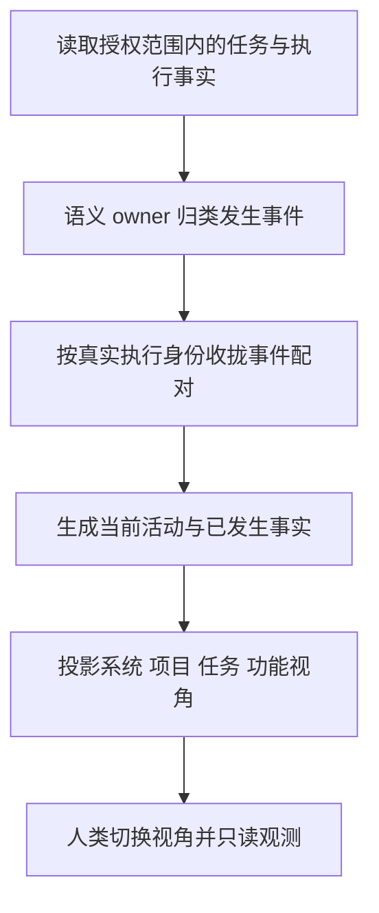
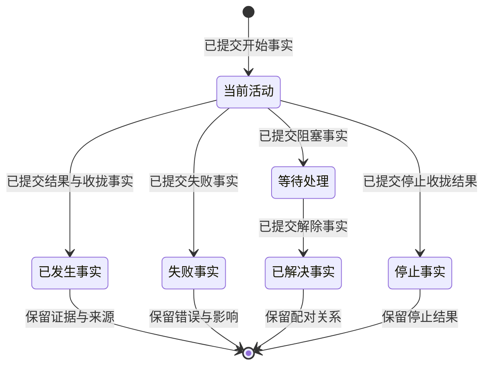

# 语义观测：功能差距与完整开发目标

交付范围：功能差距报告 + 可完整走查的静态 HTML 交互设计。本轮不修改生产功能。
状态：源码审计完成；后续生产开发目标保持 OPEN。原型使用 Mock 数据，不代表运行实例已具备这些能力。
审计输入：`origin/main 9d1f39c53f09e31a4636fa75f97042c18e8bb114`，版本 `0.1.0029`。
需求修订：2026-10-08，基线 `56995b3e742b3a400efa45bb42508dd3185284fb`。该基线的 packages 与原审计输入无差异；保留有效源码事实。原测试、构建和浏览器回执仍绑定旧候选，本次未重跑。
编排者：本次用户目标的执行者。实现由独立执行者负责；不自动建立 Collab 身份。

审计结论：当前已经具备运行引擎、动态 assignment 图、执行 fencing、触发调度、任务列表、实时事件入口及两类 checkpoint 基础。完整语义观测仍未闭环。最先要修的是 context-events→公开语义投影→UX 的断边；随后复用真实 assignment/项目身份补多视角，并补任务阶段模板、计划修订历史和推理提交边界。下文共列 14 个完整目标、20 项差距及对应验收。修正上下文、历史投影查询、checkpoint 导航及生产展示偏好闭环仍为 OPEN。

## 1. 权威需求

来源：2026-10-07 本聊天用户原文。以下需求持续有效，不以实现方便或已有测试改变。

第一条消息：

> 1. 理论上，我们有不同的类型的任务（巡检，长程，单次），大致流程就不同，所以模板会不同
> 2. 对于固定的任务，每次隐式大脑进行编排会动态改变，本身就是动态的
> 3. 对于正在进行的推理，分拆为两部分：stable part + live part

本轮消息：

> 1. 你需要根据我们现有的项目实际开发的情况进行审计和修复，整理一个完整的开发目标和差距显式
> 2. 我们 UI 部分要使用最新提交的 context mode 的语义归类来渲染，ux 只关心语义，不关心真实 raw 流水，这个部分需要非常清晰的去耦合
> 3. 我们需要 ux 可以轻易的让人类从不同角度观测系统：从任务角度来切换和观测 live 任务，复盘完成的任务，也可以从功能角度来观测某一个 agent 在某一个任务中的执行或者当前的执行状态，也可以根据后台情况看当前总的概要，从上往下去看某个项目的细节

`context mode` 的当前项目实现对应 `packages/context-events` 与 `docs/architecture/context-events.md`。其 taxonomy、normalize、pairing、UI narrative 是语义归类的唯一 owner；UX 不新建另一套解释器。

用户随后明确本轮交付：

> 分两部分：1. 一个是功能差距 2. 一个是 ux 交互设计，你需要给一个静态 html 的交互设计，我可以从上面用 mock 的控件做完整的 tour，看到所有必要的界面展示

因此，下面的开发动作是后续实现合同。本轮交付审计结论和 `semantic-observation-tour.html`，不以原型中的模拟行为代替真实功能接线。

补充需求（2026-10-07，本聊天）：

> 我们界面也要控件化，可复用，不要每个页面重新写 ui

该要求同时约束静态原型与后续产品实现：页面是语义控件的组合，控件接收投影，不在各页面复制数据解释、状态和交互逻辑。

第二次补充（同日，本聊天）：

> 1. 整个 ui 系统都是 event driven
> 2. ui 系统都是模块化
> 3. payload 共享都是 arc

事件驱动与模块化是完整 UI 的要求，不能只给按钮增加 click 监听就宣称完成。arc 暂按不可变共享引用的合同设计，并明确模块数据边；浏览器用只读 JS 共享引用表达这一合同，不宣称 Rust 原生原子引用计数或跨进程零拷贝。用户已收到 arc 的异步语义澄清问题；该项仍是设计假设，生产具体类型必须在实施前按真实 owner 的契约确定。

### 1.1 最新权威需求（2026-10-08，R1–R1.4）

本节补充并修订展示合同。R1.4 取代早期三模式命名与冷启动 semantic 默认值；以下四模式为唯一合同。

- 平台第二站先按 typed 类型分为单次、定时巡检、长程三组，再提供生命周期筛选。类型不从触发频率、标题或耗时推断。
- 单次为观察→计划→执行→review→一次结果。巡检重复同一检查定义，并比较兼容的历史检查项。长程由多个有界小循环组成；每轮完成整体目标的一部分，review 后更新全程编排。三模板均支持实际动态修订。
- 节点、边、checkpoint 和流程图共用控件。模板配置阶段、骨架依赖、布局及循环呈现；实际已发布 revision 决定实例节点与依赖。模板骨架与实际图必须分开标识。
- 接受修正后，仅从后续有效上下文排除明确声明的错误引用。不可变 checkpoint、旧投影、实际动作和 raw 记录保留；未解决的 Attention 与恢复责任继续有效。
- 每个 checkpoint 有身份、标号、简介、上下文/语义引用和可读取的原始执行结果引用。当前 checkpoint、查看 checkpoint、当前/查看计划 revision、cycle、occurrence 和投影发布版本分别显示。回退/前进追加历史；不删除轨迹，不伪造副作用撤销。
- 展示分为 `current`（简洁：仅当前最新编排）、`semantic`（完整有序修订演变）、`actions`（实际动作时间线）和 `raw`（多记录原始流水账）。切换只改变查看选择，不改变领域引用或执行状态。完整模式合同见第 8 节。
- 默认展示可保存四个固定模式或跟随最后一次手动选择。有效显式链接优先于已保存偏好，已保存偏好优先于冷启动 `current`。Tour 与程序导航不能覆写偏好。保存/重置失败须如实显示。偏好只含版本化展示字段；Mock 浏览器存储不证明生产配置交付。

## 2. 完整开发目标与验收

| ID | 用户结果 | 完成条件 | 唯一 owner | 验收入口 |
|---|---|---|---|---|
| G1 | 不同任务类型采用不同模板 | typed 类型先分三组再筛生命周期；单次四阶段、巡检重复同一检查、长程多轮有界循环；触发策略独立 | core 的领域规则；runtime 装配；UI 类型分组 | 创建三种任务；两次兼容巡检比较；长程两轮 review 后更新全程编排 |
| G2 | 同一任务的编排会动态变化 | 简洁只读最新编排；语义展示完整有序 revision 演变，每次 why/what、节点/边/阶段变化、前后关系与 checkpoint/证据可读；动作/raw 独立 | runtime 的编排 owner；core 生命周期；UI 只读展示 | 三模板动态修订；长程简洁无旧图堆叠，语义 v1→v2→v3 可查；已执行事实与在途责任保留 |
| G3 | 正在执行内容分为 stable/live | 已提交内容与当前活动分开；工具返回/失败能推进稳定事实；输出生成中不冒充完成 | context-events 语义 owner；UI projection | 同一轮工具 invoke/result 与后续活动、并行调用、失败、停止、刷新 |
| G4 | UX 消费共同语义 | 当前主界面使用 canonical → pairing → narrative；前端不读取 raw kind/arguments 推断状态/阶段；unmapped 显式可见 | context-events；packages/ui projection | 真实公开 API 到浏览器，成功/失败/未知类型与跨 scope 隔离 |
| G5 | 从任务角度切换 live 与复盘 | 可选任务；当前任务实时更新；终态可复盘；四模式与历史选择在合法链接中保留，默认按显式链接→保存偏好→current 解析 | packages/ui；app 只读 API | 两任务并行、终态、刷新/深链；四固定偏好与跟随手动选择；未知选择和读取失败可见 |
| G6 | 从功能角度看某 agent 的执行 | 能按真实 agent 身份和 task scope 查询当前/历史活动；功能角色和运行实例不混同 | runtime 真实身份生产者；UI projection | 同功能不同实例/不同任务，验证归属与状态隔离 |
| G7 | 从后台概要下钻项目细节 | 系统概要 → 已声明项目 → 任务 → 功能执行/节点；各层使用同一语义事实和真实 scope | app 只读组装；config 项目身份；UI projection | 总数与状态一致、项目隔离、面包屑返回、未知项目显式错误 |
| G8 | 观测与控制完全分离 | 观测请求不消费需求、不推进任务、不触发 retry/steer；raw 仅在主动证据查看或显式 raw 模式读取；设置只改展示偏好 | app API；runtime command owner；UI 偏好 owner | GET、模式切换与偏好操作前后任务/Journal/领域 refs 未变化，错误仍可读，控制入口维持原 owner |
| G9 | 界面控件化并复用 | 相同语义/交互由同一控件渲染，视角只组合；节点/边/checkpoint/循环组和图共用 renderer；模板配置阶段、骨架依赖、布局、循环；实际 revision 决定实例图 | packages/ui；现有 docs/ui 共享控件 owner | 三模板、当前与历史图复用同一控件；状态/证据/键盘/drawer 一致；骨架不覆盖实际依赖；未分配阶段的真实节点仍可见 |
| G10 | 整个 UI 事件驱动 | 投影、导航、连接、证据与偏好走声明事件；模块按订阅更新，不跨模块写状态或轮询解释 raw；只有成功的直接手动模式选择可更新跟随偏好；Mock 命令独立 | UI 事件与订阅 owner；app 只提供 typed 数据事件 | 同一更新驱动受影响消费者；scope 隔离、卸载退订；失败/断连可见；初始加载/链接回放/Tour 不保存偏好；导航不推进执行 |
| G11 | 整个 UI 模块化 | 输入、共享引用、事件、导航、视角、控件、证据、偏好和 Mock 驱动各有 owner；生产偏好使用 typed UI/config 合同及 ~/.humanagent 派生路径 | packages/ui；packages/config；app 组装 | 不重建业务状态；UI 不解析 TOML；版本化偏好仅存展示字段；保存/重置失败局部可见 |
| G12 | payload 以 arc 共享 | 语义 owner 产生不可变 payload；模块通过声明数据边共享同一引用；事件携引用及必要关联，不按页面复制 payload；更新产生新引用并保留旧版本 | 语义 payload 与 UI 共享引用 owner | 多消费者读到同一对象/版本；一个消费者不能修改其他消费者的内容；raw 证据独立；浏览器原型只验证共享引用语义，原生 Arc 由对应语言边界另验 |
| G13 | 修正后有效上下文与历史同时正确 | 仅排除声明错误 refs；未解决义务保留；旧 checkpoint/投影、动作/raw 保留且可查询；回退/前进追加历史 | core 错误/恢复规则；runtime 上下文编排；Journal 历史 owner | 修正前后 ref 集合与历史前缀核对；回退/再前进后副作用记录、责任与旧快照不变 |
| G14 | checkpoint 当前/查看和语义/raw 可追溯 | 身份、标号、简介与 context/semantic/raw refs 可读；当前与查看游标及 plan/cycle/occurrence 独立；未知目标显式失败 | contracts 类型；runtime checkpoint 编排；app 查询；UI 导航 | 同任务及绑定 Agent 历史链接；当前/查看同时标记；跨任务、未知、未提交目标不替换为其他快照 |

G1–G14 均为总目标。可用增量不降低终验条件。生产交付全部保持 OPEN；源码基础与 Mock 不能关闭新闭环。G12 的具体类型仍需消除前述语义歧义。

## 3. 已核实的实际情况

| 能力 | 当前实现与证据 | 差距 / 判定 |
|---|---|---|
| 统一语义分类 | `packages/context-events/src/index.ts`；18 类 canonical，normalize、pairing、narrative 已实现 | 模块存在；尚不能据此宣称 UI 接入 |
| Organ checkpoint | 领域类型实际命名 `Checkpoint`：[contracts/index.ts](../../packages/contracts/src/index.ts)，第 82–95 行；已有 id/seq/previousCheckpointId/summary/recoveryStateRef/evidenceRefs | 已有身份、序号、简介、恢复和证据基础；不等于 checkpoint 历史查询/产品 UI 已闭环 |
| Agent loop checkpoint 与 context | [contracts/agent-loop.ts](../../packages/contracts/src/agent-loop.ts)，第 23–32、128–148 行；AgentLoopCheckpoint 有 sequence/predecessor/contextViewRef；ContextView 有 activeRefs/omittedRefs；ContextReplacement 关联前后 checkpoint/context refs | 已有独立 loop 与上下文替换合同；不能把两类 checkpoint 或计划 revision 混为同一编号 |
| runtime 上下文替换与历史基础 | [agent-loop/runtime.ts](../../packages/runtime/src/agent-loop/runtime.ts)，第 416、432–484、505–520 行；replaceContext/commitReplacement 创建后继序号与 refs，第 249 行公开 checkpointHistory 快照 | 已有替换和 loop checkpoint 历史基础。产品回退/前进、持久化旧投影及 API/UI/原始结果关联闭环未验证，不能仅凭源码宣称交付 |
| 有效路径过滤 | [context/index.ts](../../packages/runtime/src/context/index.ts)，第 172–192 行；pruneEffectivePath 要求绝对文件路径，按文件路径前缀筛选 | 是文件引用过滤；不是语义错误分支删除或历史投影查询的证明 |
| checkpoint 窗口 | [checkpoints/windows.ts](../../packages/runtime/src/checkpoints/windows.ts)，第 40–69 行；有界 working/reporting evidence refs，working 保留 recoveryStateRef | 已有窗口装配；窗口淘汰不能替代或删除恢复状态、Journal 和不可变历史 |
| checkpoint/error narrative | [taxonomy.ts](../../packages/context-events/src/taxonomy.ts)，第 44、47–48 行有 error.resolved/checkpoint.committed/reentered；[projector.ts](../../packages/context-events/src/projector.ts)，第 104、185、294 行过滤/记录 superseded | canonical 语义基础存在；narrative 过滤不证明生产正确上下文选择、历史保留和查询已接线 |
| 模块测试（历史） | 原审计候选 `pnpm test:context-events`，143/143，exit 0；本次未重跑 | 只证明模块公开 consumer；不证明生产/UI 接线 |
| UI narrative 接线 | `toUserNarrative` 当前只在 context-events 内声明；packages 其他模块无消费者 | OPEN：共同语义层到 UI 的断边 |
| 观测 API | `UiRuntimeService.observation`，`packages/app/src/ui-runtime/service.ts:2199` | 根 scope 固定 registry；provider 子 scope 直接使用事件 kind 建节点 |
| 任务类型 | `Task`，`packages/contracts/src/index.ts:48`；agent-templates 只定义功能角色模板 | 无巡检/长程/单次阶段模板身份；禁止把角色模板当任务模板，也不能根据标题/耗时推断类型 |
| 触发与 occurrence | `ExecutionMode=once/scheduled/recurring`；`packages/runtime/src/subscriptions/index.ts:657`；app scheduler 与真实 occurrence 执行已接线 | 可复用触发、认领与任务绑定；触发频率不等于任务流程模板。调度图仍标 partial，不能报告整条巡检能力已完成 |
| 动态执行编排 | `packages/runtime/src/orchestration/assignment-graph.ts:201`；manager 的 planStage→dispatch→acceptResult→reviewAndMerge；app taskAssembly 已使用图快照 | 执行引擎已有，不需重建。动态图未进入 UI；任务计划版本、修订历史缺失；持久化/崩溃恢复没有本轮证据 |
| 隐式默认编排 | `packages/runtime/src/admission/implicit-orchestrator.ts:197` 当前默认发一个通用 executor subtask，按串行方式执行 | 引擎有动态图不等于 Brain 已根据三模板持续修订计划；还需真实规划输出、修订准入与版本接线 |
| 执行实例归属 | RuntimePoolLease 有 runtimeId/generation/epoch/ownerId/assignmentId；结果接受有 fencing；`assignment-graph.ts:397` | 底层已有真实绑定可复用；UI 却使用角色 frame。应公开已有真实归属，不能再造实例身份 |
| 当前轮次 | registry 明确 attempt 是轮次；`node-registry.ts:7`；观测迭代却取 executionEpoch，`service.ts:476` | attempt 与执行 epoch 混同，属于已确认的契约差距；后续按 assignment 真源修正 |
| 任务 scope | `ScopeRef`，`packages/contracts/src/index.ts:18` | organ/task/cycle/operation；无 project/agent 身份，不能自行拼接假身份 |
| 任务列表与概要 | `UiRuntimeService.listTasks/dashboard`，`service.ts:1961`；`tasks.js:142` 按生命周期分组，task-dashboard 有 SSE/轮询 | 已有任务切换与部分实时观测；复盘仍走 raw trace，没有语义复盘与项目维度 |
| 项目身份 | config 的 canonical workspace、`project.json`、RuntimePaths；`packages/config/src/index.ts:771`；runtime memory/workspace 装配已使用 projectKey | 身份已存在；未进入任务/观测公开投影与导航。跨项目总览也未接线，不能从路径或标题推断项目 |
| 现有 agent 展示 | `agentIdForRole/agentFrames`，`service.ts:606` | 角色到显示 frame 的映射；不能当作真实执行 agent 的 durable binding |
| 现有共享 UI | `docs/ui/runtime-shell.js` 的壳、状态、错误与导航函数；`interaction-work-card.js:1138` 的 mount/update 共享卡；Observation、交互页和卡片页有消费者 | 已有复用基础，应扩展唯一控件 owner；多视角任务/语义事实/编排版本尚没有统一的控件合同，不能每页重新实现 |
| 图治理（历史） | 原轮修订 observation-read graph 为 v3；`dagpipe graph validate` 8 nodes/7 edges PASS；独立设计 review PASS；本次未改图/重验 | 这是后续语义接线的设计候选，不是当前生产拓扑；拓扑校验与设计 review 不能替代实现验收 |
| 基础构建（历史） | 原候选独立 clean worktree offline install、contracts/config/app build exit 0；本次未重跑 | 构建能力曾验证；不等同当前安装/正式运行验证 |
| 正式实例入口（历史） | 原轮已安装 `humanagent --version=0.1.0029`；10086 API 返回 `auth.session.missing`；本次未核验实例 | 未取得正式任务数据；本次无 daemon/auth 修改，live 验收尚未确认 |

判定分为四种：**已实现但未接线**、**领域事实缺失**、**UX 能力缺失**、**运行验收未确认**。前三种需要开发，第四种需要实际入口证据；不能相互替代。

### 3.1 可执行差距清单

优先级表示依赖顺序。P0 是语义正确性的前置条件，P1 是主要用户路径，P2 是完整生命周期收口。所有条目尚未实施。

| 差距 | 分类 / 优先级 | 具体开发目标与唯一 owner | 依赖与关闭条件 |
|---|---|---|---|
| F01 语义模块无生产消费者 | 已实现未接线 / P0 | context-events 增补实际运行输入适配；app 读取事实→归类→配对→narrative；UI 只消费 typed 语义 | 覆盖真实 RuntimeTaskEvent/Provider 来源、并行和失败；实际 API→浏览器证明一致 |
| F02 关联配对边界不足 | 契约/接线缺口 / P0 | 在语义 owner 明确 task/operation/epoch/callId 隔离与输入顺序；删除本地 raw 配对重复逻辑 | 交错调用、重试、不同 task 不误配。当前 pairing 最近同类型 opener 不能直接处理混合流 |
| F03 unknown/unmapped 无公开出口 | 已实现未接线 / P0 | app + UI projection 公布覆盖缺口、原因、来源引用；UX 有明确未知状态 | 不丢事件、不显示成功、不用 raw fallback 猜语义；未知类型公开入口回归 |
| F04 三类任务阶段模板缺失 | 领域能力缺失 / P1 | contracts/core 定义 typed 模板与版本；runtime 装配单次四阶段、巡检相同检查、长程有界循环；UI 类型先于生命周期 | 三类型真实绑定；兼容检查历史比较，不兼容定义标明不可直接比较；长程两轮 review 更新全程计划 |
| F05 任务计划修订历史缺失 | 领域能力缺失 / P1 | runtime + Journal 追加 revision、why/what、节点/边/阶段差异、前后关系和 checkpoint/证据关联；core 定义许可/收拢 | 简洁仅最新，语义展示完整有序演变而非仅快照 dropdown；旧事实不改写；policyRevision 不冒充计划版本 |
| F06 动态执行图未投影 | 已实现未接线 / P1 | app 把真实 assignment 快照交给 UI projection；区分固定系统骨架与任务实际编排 | 图展示真实并行依赖与节点状态；计划版本切换不改变当前实例；F05 提供历史 |
| F07 推理 stable/live 生产边界缺失 | 领域/接线缺口 / P1 | runtime 提交当前公开推理片段与稳定水位；context-events 语义收拢；UI 展示已确认/正在形成 | 工具结果、失败、等待、停止都能稳定提交；刷新保留历史；任务终态无残留 live |
| F08 节点/轮次/assignment 未进入 live 观测 | 接线缺口 / P0→P1 | runtime 提供真实 node/attempt/assignment；UI contracts 与 projection 区分 attempt 和 executionEpoch | 重试、并行、epoch 切换均归属正确；旧实例结果不能关闭新实例 |
| F09 真实 Agent 实例未公开 | 已实现未接线 / P1 | runtime 的真实 lease/assignment 归属进入只读投影；contracts 承载身份；UI 角色与实例分开 | 同角色不同实例、同实例指定任务轨迹隔离；角色 frame 不能作为 durable agent ID |
| F10 项目归属和跨项目总览缺失 | 身份已有、投影/聚合缺失 / P1 | config 提供已校验项目身份；任务持有 typed 归属；app 授权范围内聚合；UI 系统→项目→任务 | 两真实项目总数与明细一致；未知/未授权项目显式失败；不从目录名称伪造身份 |
| F11 语义 live/复盘与跨视角导航缺失 | UX 能力缺失 / P1 | UI 复用列表/SSE/详情；四模式链接保留 project/task/instance/scope 与历史选择；默认按显式链接→偏好→current | 两任务、终态、刷新/深链；旧 revision 不能标为 current；未知/矛盾选择显式失败；F01/F09/F10/F20 是数据前置 |
| F12 断连/过期/空态统一语义缺失 | UX/契约缺口 / P1 | API 状态、领域生命周期、连接新鲜度分别投影；UI 保留上次内容并标 stale | 读取失败不变空列表成功；未知实体不静默跳首页；重连后状态可核 |
| F13 动态图持久化/恢复未确认 | 运行证据缺口 / P2 | runtime + Journal owner 核查持久化真源，补齐缺边；不以 UI snapshot 恢复控制状态 | 崩溃后计划、已执行事实、在途责任和实例 fencing 正确恢复；无实测不得关闭 |
| F14 多视角黑盒与只读证明缺失 | 验收缺口 / 每轮 | tests/app + tests/ui 经公开服务/真实浏览器验证；核对导航、偏好、Tour 前后 Journal/领域 refs 与历史前缀 | 四模式、默认优先级、历史不删除、保存失败及副作用断言通过后才审查；Mock 不冒充生产 |
| F15 多视角语义控件复用不足 | UI 架构缺口 / P0→P1 | 复用壳/工作卡；共同 graph/node/edge/checkpoint/cycle 控件消费模板配置与实际 revision；当前/历史图同一 renderer | 三模板和多视角真实消费者；骨架/实际依赖分开；不建第二 taxonomy 或逐页图/CSS 副本 |
| F16 整体 UI 事件模型缺失 | 已有 SSE、整体契约缺失 / P0→P1 | 声明投影、新鲜度、导航、证据、偏好保存/重置与直接手动选择事件；订阅归各 owner | 初始加载/回放/Tour 不写偏好；只成功手动选择更新 follow-last；跨 scope 旧事件隔离，退订有效 |
| F17 UI 模块边界未覆盖多视角 | 局部复用已有、整体缺口 / P1 | 单一组装入口；输入/引用/事件/导航/视角/控件/证据/偏好各有 owner；生产 typed UI/config 派生 ~/.humanagent 路径 | UI 不解析 TOML；仅版本化显示偏好；存储失败局部且不假报成功；不持久化 task/CP/raw/route；Mock 可替换 |
| F18 共享 payload arc 契约缺失 | 架构契约缺口 / P0→P1 | 定义只读 payload 引用、生命周期、版本和模块 arc；各控件消费同一引用，删除多页重建和不必要拷贝；跨网络边界明确解码 owner | 相同 payload 身份/版本贯穿多个视角；旧引用内容不被更新改写；原型不伪造 native Arc；具体类型依真实语言/进程边界确定 |
| F19 有效修正上下文与追加历史闭环未验证 | 基础已有、产品/运行闭环 OPEN / P0→P1 | core 定义修正/义务；runtime 复用 ContextView/ContextReplacement；Journal 与不可变资产保留旧投影、动作/raw 及关系 | 仅声明 wrong refs 排除；未解决义务仍在；修正/回退/前进后旧内容和历史前缀不变；实际副作用不假撤销 |
| F20 checkpoint 当前/查看及语义/raw 查询未闭环 | 两类 checkpoint 基础已有、查询/UI OPEN / P1 | contracts 保持身份区别；runtime 提供合法当前游标；app typed 只读查询；UI 独立历史选择，关联语义/action/raw refs | CP 编号/简介/证据可读；当前/查看及计划/cycle/occurrence 分离；未知/未提交/跨任务目标显式失败；导航不执行 |

另有现有调度图声明的风险：unknown/in-progress 结果恢复、较大巡检间隔下 latePolicy=skip 的漏槽、due-slot 的 O(total slots) 计算。它们属于源码/设计声明，尚未在本轮复现。应在巡检模板与恢复交付时核验，不能在本报告中当作已复现故障，也不能当作已解决。

### 3.2 三个概念必须分开

- **固定 Harness 骨架**：系统长期存在的输入、显式/隐式处理、执行、收拢等能力。它可以解释系统组成。
- **任务模板**：巡检、长程、单次的默认阶段和终点。它决定任务实例的初始流程，不决定运行中每一条边。
- **任务编排 revision**：隐式 Brain 根据实际输入与结果编译出的具体节点、依赖、Agent 分配和后续变化。UI 应展示这一层，并保留旧 revision。

当前固定 registry 和动态 assignment 图分别存在。差距是模板/版本领域模型与动态观测接线，不是“从零重建一个编排器”。

| 任务模板 | 默认流程与观测重点 | 触发方式是独立选项 |
|---|---|---|
| 巡检 | 重复同一检查定义→检查项结果→发现/必要处置→收拢；按 check ID 和定义/版本兼容性比较 occurrence；不兼容仍保留历史 | 可定时/周期触发，也可手动执行一轮；下一轮不是 retry |
| 长程 | 多个有界 cycle，各轮观察→小计划→执行→review；完成部分全程目标，再更新全程编排；保留 pipeline/cycle/revision 与已执行事实 | 可一次启动后持续运行；不等于 recurring |
| 单次 | 观察→计划→执行→review→一次结果与终态；运行中仍可动态修订 | 可立即或预约一次；不等于所有 once 任务都属于此模板 |

任务在已批准目标和范围内，根据新事实调整后续执行图，由隐式 Brain 的编排 owner 负责。已有任务的目标、范围或处理方式变更仍按项目契约单独确认。观测面显示修订与依据，不承担确认、资源准入或停止操作。

## 4. 语义与 UX 边界

raw/Journal/Provider adapter → context-events → typed UI projection → Runtime API → UX。

- app 读取真实事实并给出 scope 和来源身份；不能自行复制 taxonomy。
- context-events 负责类型映射、配对和 narrative。UI projection 只做语义集合的视角、排序与展示分组。
- UX 接收 title/detail/state/evidenceRefs 和已投影的 scope/功能归属，不从 raw 名称、arguments、日志或 payload 重建控制状态。
- business input/output 仍作为任务输入和结果呈现，不因语义投影裁剪真实 payload。
- unknown/unmapped 有显式计数、原因和证据入口。模块契约不支持的公开流式推理不得伪造为已确认语义。
- pairing 不能把不同 task、operation、epoch 或并行 call 的事件相互收拢。现有 pairing 只消费单一有序事件组，生产组装须先按真实关联身份划分组；不能把时间邻近当调用身份。
- 请求失败保留错误与上次成功内容，明确标记过期/断连；失败不能变成空列表成功。

## 5. Stable / live

Stable 为已发生、已提交的语义事实；不等于全部成功。失败、被拒、已解决错误也能形成稳定记录。
Live 为当前尚未收拢的活动、等待、Attention。整个任务是否运行不能由页面计时器或某条摘要决定。
已提交计划与执行事实必须有不同标签。未来计划的修订保留关系；执行事实不可被新编排改写。
对于未被 taxonomy 支持的 provider.model/output，先按当前契约报告语义覆盖不足；不能由 UX 猜测推理状态。
流式输出的稳定片段边界必须由公开生产者提交。现有 canonical active/terminal 分组只能证明语义活动 stable/live，不能声称已实现 token/prefix 级流式稳定分段。

该图描述观测事件的终点，不替代 Task/Operation 生命周期；重试启动新执行，不回写旧事件。

## 6. 后续开发顺序与依赖

| 增量 | 本轮可用结果 | 前置依赖 | 范围与停止条件 |
|---|---|---|---|
| R1 审计与交互设计（本轮） | G1–G14/F01–F20 差距、owner 与验证矩阵；四模式静态 tour 合同 | 保留原源码审计；2026-10-08 权威需求与独立计划 | 不写生产代码；本次只更新报告与 HTML；生产 DAG 不变，Mock 不算功能验收 |
| R2 共同语义接线 | 当前任务语义 API；已发生/当前活动；隔离不同执行与未知事件 | R1 设计 PASS | 改 context-events/typed projection/app 的唯一边；不改变 Task 完成/retry/权限 |
| R3 多视角 UX 与共享控件 | 多视角、四模式、共同节点/图、事件/模块/arc 与展示偏好 | R2 typed API；G9–G12；完整历史显示还依赖 R4 的 revision 与 F20 查询 | 不捏造实例或历史；偏好由 typed UI/config 承载，UI 不解析 TOML；缺数据显式不可用 |
| R4 任务模板、动态计划和 checkpoint 历史 | 三模板、完整 revision 演变、有效修正上下文、当前/查看 CP 与语义/raw 查询 | G1/G2/G13/G14；既有两类 checkpoint/context 基础；Journal/资产持久化与恢复合同 | 接受修正→有效 refs→历史投影→公开查询→UI/证据逐边闭合；历史不删除，副作用不假撤销 |
| R5 推理分段与完整身份 | 当前推理 stable/live 的生产者边界、实际 agent 归属、跨项目总览 | G3/G6/G7 生产事实与各公开 scope | 已发生工具事实分组不能替代该终验 |

本轮止于 R1。R2–R5 是完整开发目标的后续增量；尚未实施。每轮只在对应公开事实和验收已齐备后关闭差距。

## 7. 黑盒验收矩阵

| 场景 | 公开入口与外部断言 |
|---|---|
| 分类接线 | 使用真实 UiRuntimeService/server 公共入口，读取语义 projection；title/state 与 context-events 一致 |
| 并行与重试 | 两任务、不同 operation/epoch、乱序工具返回；结果仅关闭匹配调用，另一调用仍 live |
| 失败与未知 | 错误/阻塞/停止不显示成功；未知事件报告语义不可用且保留证据，不由 UX raw fallback |
| live 到复盘 | 当前活动结果提交后转稳定记录；刷新与重新打开保留历史；终态无伪造 live |
| 导航与范围 | 系统→真实项目→任务→功能；任务切换、面包屑、链接恢复；未知 task/project/agent 显式错误 |
| 只读性 | 观测 GET 前后任务状态、Journal 内容和资源不改变；没有 retry/steer/queue 消费入口 |
| UI 架构 | 同一语义更新事件驱动多消费者；同一 payload 引用在任务/Agent/证据控件中复用；scope 切换和卸载释放订阅；旧版本保持只读 |
| 类型与模板 | 第二站 typed 单次/定时巡检/长程三组先于生命周期；单次四阶段；两 occurrence 相同 check ID/兼容定义比较；长程至少两有界 cycle，review 更新全程 revision |
| 四模式 | 简洁长程只显示当前最新图；语义完整有序 v1→v2→v3，每次 why/what、节点/边/阶段变化、前后和 CP/证据可读；actions 为已发生时间线；raw 可浏览多记录。切换不改领域 refs、CP 或历史前缀 |
| 图控件与依赖 | 三模板和各 revision 共用 renderer/node/edge/CP/cycle 控件；骨架与实际图分开；实际发布依赖优先；active 前置均 done，失败分支下游 blocked，独立分支继续 |
| 修正与历史 | 只排除声明 wrong refs；未解决 Attention/恢复义务保留；旧 CP/投影/action/raw 内容与身份不变；当前修正路径和历史错误均可查询 |
| checkpoint 与回退/前进 | 当前/查看 CP、当前/查看计划、cycle/occurrence/发布版本分离；历史查看不执行；Mock 回退/前进追加 action/raw，不删除前缀，不撤销已发生副作用或改写最新计划；未提交 CP 不称历史 |
| 关联与深链 | semantic node→action→raw 及反向链接保持 scope；未知、跨任务、未发布/未提交目标可见失败；显式 current+旧 revision 显示矛盾，不把旧图标 current；无显式模式的历史链接可打开 semantic 并标当前/查看 |
| 偏好默认与保存 | 冷启动 current；四固定默认各经 reload/新非显式打开保留；follow-last 记四种成功手动选择；显式链接优先且保存 bytes 不变；draft 不保存；Tour/初始化/回放/证据导航不覆写；Reset 只移除声明 key |
| 偏好失败与隔离 | 存储读取/写入/删除失败、格式错误及未知版本局部可见，不能假报成功；当前页面可用；仅版本化展示字段持久化，不存 task/project/agent/CP/action/raw/payload/route/凭据；领域状态不变 |
| 浏览器 | 真实 API 服务已构建 UI；桌面/窄屏、键盘、选择保持、失败可见性与截图 |
| 正式安装 | 候选与产物版本/哈希、实际入口、必要生命周期与页面复核按项目门禁记录 |
| 收口 | 作者开发/E2E 完成后独立 review PASS；最新 main 组合、远端回执和自有资源清理 |

证据必须绑定精确候选与实际入口。录制/public consumer 只能证明对应边界，不能冒充真实 Provider 或正式实例验收。

## 8. 交互设计合同

原型入口：同目录 `semantic-observation-tour.html`。单文件内嵌 CSS、JS 和已归类的语义 Mock，可直接以 file:// 打开。常驻“交互设计 · Mock 数据”标记；模拟控件与只读观测面分开。

| 界面 | 人类要回答的问题 | 交互与必要展示 |
|---|---|---|
| 系统概要 | 后台整体怎样？哪里需要我？ | 运行/等待/失败/完成汇总；待人处理；项目列表；下钻项目和任务 |
| 项目 / Tour 第二站 | 这个项目有哪些任务类型？ | 单次/定时巡检/长程 typed 三组及数量；再筛生命周期；保留任务归属、关注事项与面包屑 |
| 任务 | 目标是什么？现在做到了哪里？ | live/复盘、三模板、四模式；巡检兼容历史比较，长程有界 cycle/review/全程 replan；CP 当前/查看和计划 revision 分开 |
| 当前执行 | 哪些内容已确定？哪些正在形成？ | stable 已确认内容与 live 当前片段；并行活动；推进后形成稳定事实；失败也进入稳定历史 |
| 编排历史 | 为什么这次执行改变了？ | semantic 完整有序演变而非仅版本 dropdown；每次 why/what、节点/边/阶段差异、前后及 CP/证据；旧快照与已执行事实保留 |
| 功能/Agent | 具体谁在什么任务中执行？ | 功能角色与实例分开；选实例与任务范围；当前状态和历史语义轨迹；不串其他实例/任务 |
| 节点详情/证据 | 这一步输入、输出和依据是什么？ | 只读 drawer；语义事实和证据引用；主动打开后才能看 Mock raw；Esc 关闭和焦点归还 |
| 异常与边界 | 我能信任当前页面吗？ | 等待人类、失败原因、unknown/unmapped、断连/过期保留旧内容、空列表与恢复入口 |

Tour 必须实际改变页面、选择任务、切换版本或打开详情。必须支持上一站、下一站、目录跳转、重新开始、退出及结束反馈。独立 Mock 控件让人类在导览外也可操作所有场景。

产品主流程只消费语义字段。raw、Provider 协议名和 JSON 只在主动证据详情或显式 raw 模式呈现。生产语义接入、任务模板、计划修订、实例身份、UI 架构和 checkpoint 闭环仍按 G1–G14 验收；原型只用于评审交互。

| 模式 | 唯一展示合同 | 历史与控制边界 |
|---|---|---|
| current / 简洁 | 仅最新权威编排及有效上下文；长程不堆叠旧 revision 图 | 排除的错误分支可链接历史；不隐藏未解决义务；旧图不能标为 current |
| semantic / 语义 | 完整有序已发布修订演变；why/what、节点/边/阶段增删改、前后关系、CP/已接受结果证据 | 用保留快照和声明关联；不从当前 overlay 重建旧图，不从 raw 猜修订；缺字段显式不可用 |
| actions / 历史动作 | 实际发生的 chronological 轨迹：错误、修正、checkpoint 提交、回退、前进及结果 | 计划节点不冒充执行；多 attempt 独立；append-only，不因改计划或上下文而删动作 |
| raw / 原始流水账 | 多条原始记录的身份、顺序、scope 与 semantic/action/CP 关联；双向只读链接 | 不驱动语义分类；不只提供单结果 dialog；旧记录可读且不改写 |

四模式共用 immutable domain refs。导航只拥有 viewed mode/revision/CP/cycle/occurrence。执行/上下文当前游标属于 runtime；Mock 中仅 MockDriver 可改。每个 CP 展示 ID、标号、简介、context/semantic/raw refs。新 CP 未提交前只是下一步预览。历史选择不提交 CP、不追加 action、不调用工具。回退与后续前进必须留下新记录，并保留全部旧 trail、checkpoint 高水位和已发生副作用；不假装 undo。

展示设置提供四固定模式及 follow-last-manual。版本化偏好仅保存 mode 和必要的 lastManualMode。有效显式模式链接 > 保存偏好 > 冷 current；follow-last 尚无手动记录也选 current。历史 revision/CP 无显式模式时可选 semantic；显式 current 与旧 revision 不兼容时显示 mismatch。非法显式选择不能被偏好掩盖。

设置显示保存值、有效默认、draft、Save 和 Reset。draft 不写存储。Save 只作用于未来非显式打开，不替换当前显式链接。只有验证成功的直接手动模式选择可更新 follow-last；初始化、hash 回放、浏览器导航、证据链接、Tour、程序路由及设置 Save 均不能记为手动选择。Reset 仅移除本偏好 key。读/写/删除失败或未知版本须标明操作与未保存状态，保留当前视图，不伪造持久化成功。

静态 Mock 只演示窄范围浏览器偏好。生产由 `packages/ui` 拥有展示行为，`packages/config` 拥有 typed 验证与 `~/.humanagent` 持久化路径派生，app 组装控制 API。UI 不解析 TOML，不把偏好变成领域控制真相，不在 project workspace 存 user profile。该生产闭环 OPEN。

### 8.1 控件与模块合同

页面模块只决定作用域和布局，传入同一语义投影。控件不读取 Journal、Provider raw 或请求 API，也不自行判断 retry、任务终态、资源准入和实例归属。

| 共享控件 | 语义输入 / 展示职责 | 复用消费者 |
|---|---|---|
| ScopeNavigator | 已声明 scope、当前选择、面包屑；发导航/选择事件 | 全部视角 |
| StatusSummary / StateNotice | 聚合语义状态、新鲜度、失败/未知原因；不从连接状态推断任务状态 | 系统、项目、任务、Agent |
| TaskCollection / TaskSummary | 同一任务引用及筛选；紧凑行/详情变体复用状态与证据入口 | 系统关注列表、项目任务、任务切换、Agent 当前任务 |
| TemplateSections / GraphControls | 配置阶段、骨架依赖、布局和 loop；同一 renderer/node/edge/CP/cycle 控件消费实际发布 revision；未分配阶段节点显式呈现 | 三模板、current 图、semantic 历史图、绑定 Agent |
| SemanticActivity / StableLive | 同一语义事实引用；已确认/当前活动/历史轨迹变体；失败和等待标签共享 | 任务当前执行、任务复盘、Agent 指定任务轨迹 |
| OrchestrationViewer / VersionHistory / CheckpointPath | 当前最新图、完整有序 revision 演变、当前/查看 CP、标号简介与语义/原始证据关联；不改写已执行事实 | 任务编排、历史复盘、Agent 执行下钻 |
| DisplayMode / DisplayPreference | 四模式及四固定默认/跟随手动设置；draft、保存/重置状态；只发导航或偏好事件 | 任务与绑定 Agent；共享设置入口 |
| AgentScopePicker | 功能角色、真实实例与允许的任务范围；发选择事件 | 功能视角、任务内执行归属 |
| EvidenceDrawer | 同一证据引用的语义、输入/输出、主动 raw 展开；焦点和关闭生命周期统一 | 全部节点与事实证据入口 |

模块链：语义输入适配 → 共享 payload 引用 owner → UI 事件通知 → scope/navigation selector → 视角组合 → 共享控件。证据读取为独立的只读模块；Mock 驱动为独立演示模块，生产替换时保留相同语义输入端口。

事件至少分为：ProjectionAvailable/Updated、ConnectionChanged、ScopeSelected、NavigationRequested、EvidenceRequested/Closed；偏好另有 DisplayPreferenceSaveRequested/ResetRequested、DisplayPerspectiveManuallySelected、DisplayPreferenceChanged。Mock 的 ActivityAdvanceRequested、ReplanRequested、ScenarioSelected、修正和 CP 回退/前进请求放在独立模拟控制面；观测模块不能发布真实 runtime 控制命令。事件通知与 payload 引用分开，控件不能根据事件名字猜业务状态。

原型模块合同：SemanticFixtures、PayloadRefs、UiEvents、Navigation、MockDriver、Views、Controls、Evidence、DisplayPreference、Tour、App。Navigation 只选 scope/mode/历史版本与 CP；MockDriver 是模拟事实和最新编排 authority 的唯一 owner。PayloadRefs 保留不可变发布快照；Controls 拥有模板/图控件；Evidence 拥有只读记录与 drawer/焦点；DisplayPreference 独占窄存储及状态，其引用不混入领域 payload。新鲜度不改变任务终态。

静态模块流为 `SemanticFixtures→MockDriver→PayloadRefs→UiEvents→Views/Controls`；`Navigation→历史查看选择→Views/Controls`；`Mock 控制事件→MockDriver→新投影`；`EvidenceRequested→Evidence→只读结果`；`偏好事件→DisplayPreference→状态引用→App/Controls`。成功终点是准确渲染；错误终点是显式提示并保留可用内容；取消终点是关闭 drawer/Tour 并归还焦点；清理终点是释放自有订阅和浏览器资源，由 root 核对。仅为静态文档模块流，生产 DAG 不变，不代表生产接线 PASS。

单文件 HTML 可以内嵌独立模块和共享控件实现；“单文件”是交付方式，不是允许一个页面复制一套 UI。生产模块在 packages/ui 的唯一 owner 下落地，沿用已有壳/工作卡消费者；不为了原型引入新框架或另一份 taxonomy。

### 8.2 Payload arc 共享边界

语义 payload、UI 选择状态和模拟控制命令分别承载。arc 只读共享语义 payload，不能把 steer、健康、权限、retry 等控制真相混入任务业务 payload。

每个 payload 的创建与替换只有一个 owner。视角、控件和证据索引共享引用；事件负责通知引用可用/变化。新事实产生新 payload 引用，未变内容复用既有引用，旧版本保留原内容。消费者不使用 JSON stringify/parse 或整块 deep clone 来建立自己的事实副本。

原型引用合同为 `{ id, scopeKey, revision, value }`，其中 value 和嵌套语义内容只读。同一发布的多个消费者收到同一引用。只读 consumer 入口 `window.TourPrototype.getProjectionRef(scopeKey)` 和 `subscribe(type, handler)` 用于补充验证引用身份与退订；实际界面验收仍从可见控件进入。

浏览器 JS、后端 TypeScript 与将来可能存在的原生边界不能共享一个跨进程内存地址。网络适配器负责一次解码并交给当前进程的共享引用 owner；如果 native owner 使用 Arc<T>，它在自身进程内持有 Arc。此处定义的是可核验共享合同，不把“版本 ID”当作已经实现的引用共享证据。

## 9. 历史验证、本次检查与边界

历史已验证（2026-10-07，原审计候选 `9d1f39c53f09e31a4636fa75f97042c18e8bb114`）：context-events 143/143；contracts/config/app 构建通过；设计 graph 拓扑通过；独立设计审查 PASS。旧静态 HTML 从实际 `file://` 入口，在 1440、768、390 三种宽度各走完 27 站，共 81 站。三模板动态修订、current v3/view v1 历史查看、stable/live、终态空 live、节点和主动 raw drawer、系统/项目/任务/Agent scope、异常深链、Mock 成功/失败、共享引用与退订均有旧浏览器回执。详情见 [browser-acceptance.md](evidence/semantic-observation-20261007/browser-acceptance.md)。这些回执不证明 2026-10-08 新合同通过。

旧轮修复了原型验收与独立复盘发现的 6 个问题：历史版本参数丢失、未发布候选误称历史、失败终态残留 live、Esc 后 drawer 选择与焦点残留、live 失败未进入关注，以及计划修订后旧 active 节点未按新依赖重新判定。旧最终 HTML SHA256 为 `558fd1f961f54ecc6787e85cf045c896a798e8b65c44715f58655d619078f91a`。旧三种宽度共 81 站逐站检查当前公开图的 active 节点前置均 done；v2 成功后切 v3 的汇合节点先 waiting，分支失败后 blocked，独立并行分支继续 active。这些修复只属于旧 Mock 原型。

旧候选截图检查为 `UNVERIFIED`：旧轮 Ego 的 `Page.captureScreenshot` 多次 CDP 超时，未生成可用截图。旧页面 DOM、布局尺寸、原生 Tour 点击、键盘和命中核验后的原生鼠标证据已通过；这些旧证据不包含截图视觉审查。2026-10-08 新候选截图已生成并由 root 检查，见下述新验收。

旧正式实例只读 API 返回 `auth.session.missing`，没有取得正式任务数据；不是本次实例状态核验。本次报告作者未安装、未重启、未请求真实 Provider，未执行浏览器或 runtime E2E。G1–G14/F01–F20 生产交付全部保持 OPEN。

2026-10-08 报告完成 docs 针对性检查：差异空白、文件 allowlist、14 个目标/20 个差距 ID、新增源码定位与本地链接。独立作者交付 HTML 后，root 从实际 file 入口验收冻结的 35 站。新候选 SHA256 为 `3a85040bfe69200af5d37c31a420c594d6ddac8f182bb8e815b8ad4f010da505`。基线 65 项、长程修订 20 项、专项 19 项，共 104 项浏览器断言通过；三个宽度各 35 站，共 105 站，以及 24 个断点视图通过。历史 v2 和 390px 项目分类截图已生成并检查。回执与边界见 [2026-10-08 静态验收](evidence/semantic-checkpoints-20261008/acceptance.md)。这些结果只证明新静态原型，不关闭生产目标。独立 review、主路径集成及资源清理回执由 root 的过程笔记记录。

专项来源归档在 `evidence/semantic-observation-20261007/`：`context-audit.md`、`orchestration-audit.md`、`ux-audit.md`。三份均基于原审计输入 SHA，仅做只读源码/契约审计。其中测试用例引用不是本次执行结果；旧运行实例证据仅证明旧记录边界。专项建议属于候选方案，最终开发应由唯一 owner 根据公开事实和依赖图选择。
